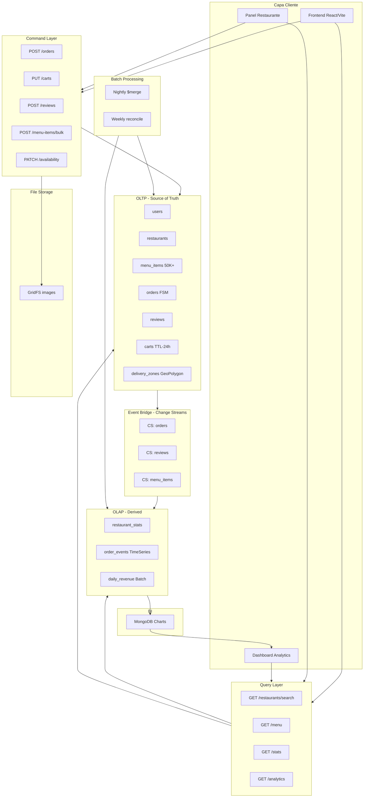
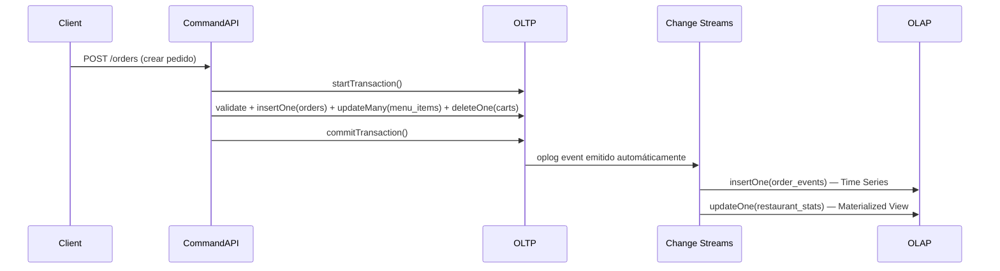
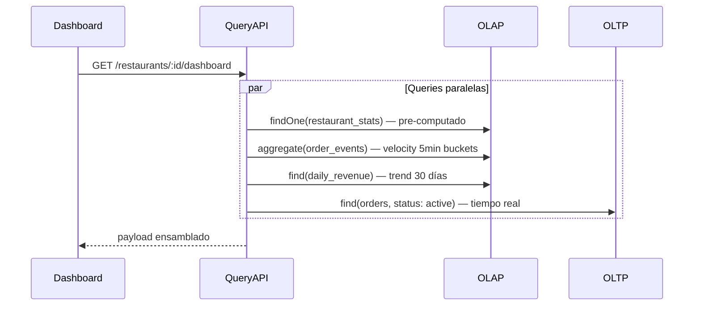
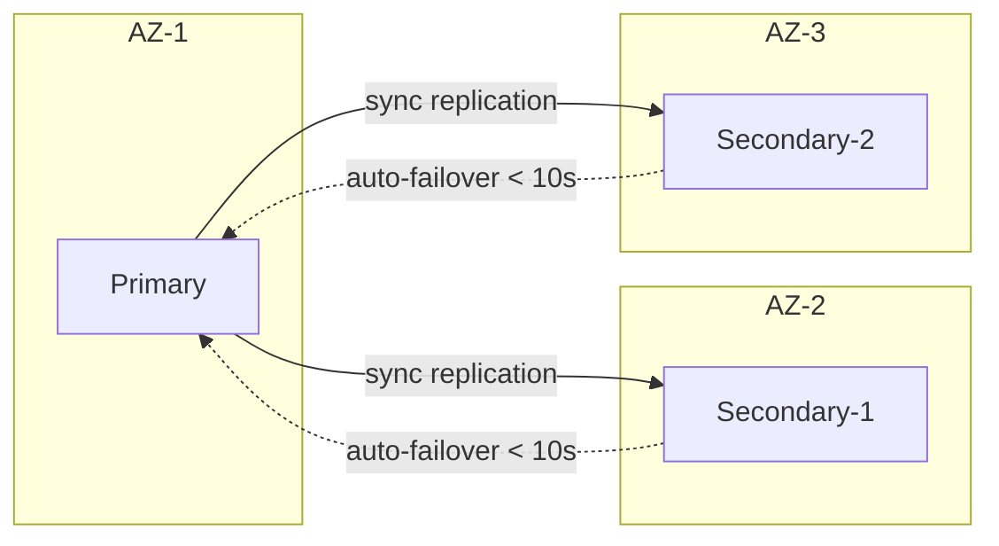
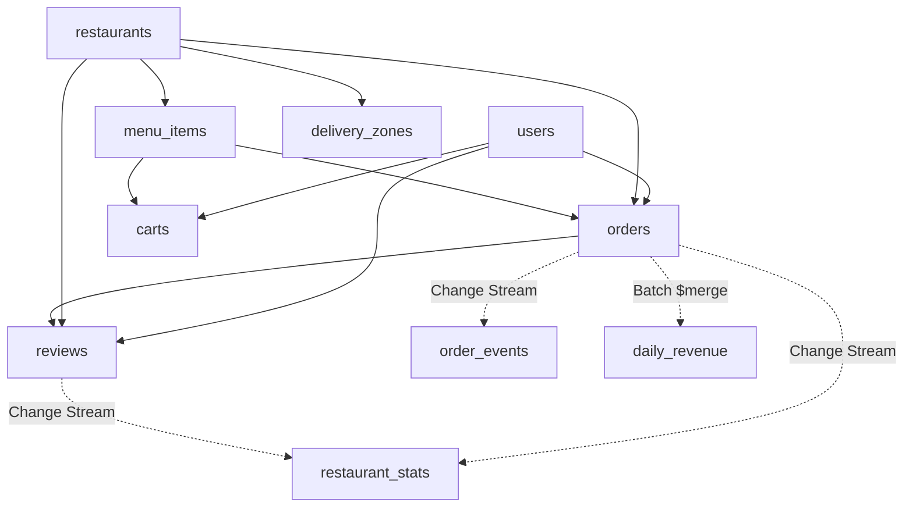

# 2. Arquitectura del Sistema

## 2.1 Patrón Arquitectónico: CQRS + Event-Driven

El sistema implementa **CQRS (Command Query Responsibility Segregation)** donde:

- **Write Path (Command):** Todas las mutaciones van a las 7 colecciones OLTP (source of truth)
- **Event Bridge:** Change Streams escuchan mutaciones en `orders`, `reviews`, `menu_items` y propagan cambios
- **Read Path (Query):** Dashboards y analítica leen de 3 colecciones OLAP pre-computadas (0 $lookups at query time)



---

## 2.2 Write Path (Detalle)



**Garantías del Write Path:**
- `writeConcern: { w: "majority" }` para pedidos y transacciones
- `retryWrites: true` habilitado en connection string
- Transacciones multi-documento con `session.withTransaction()`

---

## 2.3 Read Path (Detalle)



**Garantías del Read Path:**
- `readConcern: "local"` para OLAP (eventual consistency aceptable)
- `readPreference: "secondaryPreferred"` para dashboards (descargar al primary)
- Cero `$lookup` en queries de dashboard (todo pre-computado)

---

## 2.4 Event Bridge (Change Streams)

```
┌─────────────┐     ┌──────────────────────────────────────────────────────┐
│ orders      │────>│ Change Stream Processor #1                           │
│ (insert/    │     │  ├── insertOne(order_events) — Time Series event     │
│  update)    │     │  ├── updateOne(restaurant_stats) — $inc totals       │
│             │     │  └── On "delivered": $inc totalRevenue, avgOrderValue│
└─────────────┘     └──────────────────────────────────────────────────────┘

┌─────────────┐     ┌──────────────────────────────────────────────────────┐
│ reviews     │────>│ Change Stream Processor #2                           │
│ (insert)    │     │  ├── Incremental avgRating recalc (O(1))             │
│             │     │  ├── $inc totalReviews                               │
│             │     │  └── $inc ratingDistribution[rating]                 │
└─────────────┘     └──────────────────────────────────────────────────────┘

┌─────────────┐     ┌──────────────────────────────────────────────────────┐
│ menu_items  │────>│ Change Stream Processor #3                           │
│ (update     │     │  └── On bulk insert: $set restaurant menuItemCount   │
│  available) │     │                                                      │
└─────────────┘     └──────────────────────────────────────────────────────┘
```

---

## 2.5 Batch Processing Layer

| Job | Frecuencia | Source | Target | Operación |
|-----|------------|--------|--------|-----------|
| Daily Revenue | Nightly 02:00 UTC | `orders` (delivered) | `daily_revenue` | $match → $unwind → $group → $merge |
| Stats Reconciliation | Weekly | `orders` + `reviews` | `restaurant_stats` | Full recompute → $merge (overwrite) |
| Seed Data | One-time | Script | `menu_items` | bulkWrite 50K+ docs |

---

## 2.6 Alta Disponibilidad



| Parámetro | Valor OLTP | Valor OLAP |
|-----------|------------|------------|
| Write Concern | `w: "majority"` | `w: 1` |
| Read Concern | `readConcern: "majority"` | `readConcern: "local"` |
| Read Preference | `primary` | `secondaryPreferred` |
| Consistencia | Fuerte (causal sessions) | Eventual |
| Retryable Writes | Sí | N/A |

---

## 2.7 Árbol de Dependencias entre Colecciones



Líneas sólidas = referencias directas (FK). Líneas punteadas = propagación asíncrona.
