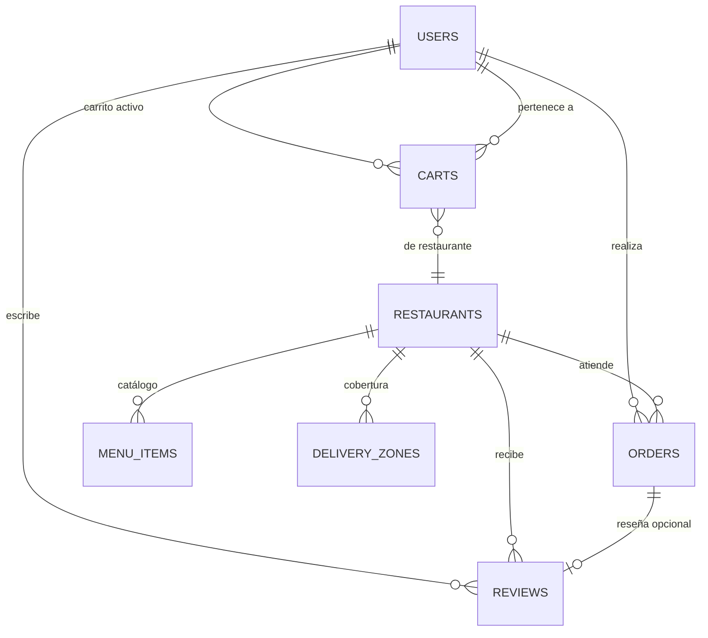

# 3. Modelo de Datos — Capa Transaccional (7 Colecciones OLTP)

## 3.1 Diagrama de Relaciones



---

## 3.2 Colección: `users`

**Propósito:** Perfiles de usuario con dirección embebida y preferencias.

**Ejemplo de documento:**

```json
{
  "_id": "ObjectId('507f1f77bcf86cd799439011')",
  "email": "maria@example.com",
  "name": "María López",
  "phone": "+502 5555-1234",
  "role": "customer",
  "defaultAddress": {
    "street": "6a Avenida 12-34",
    "city": "Guatemala",
    "zone": "Zona 10",
    "coordinates": { "type": "Point", "coordinates": [-90.5069, 14.5943] }
  },
  "orderHistory": ["ObjectId('ord1')", "ObjectId('ord2')", "ObjectId('ord3')"],
  "favoriteRestaurants": ["ObjectId('rest1')", "ObjectId('rest2')"],
  "createdAt": "2026-01-15T08:00:00Z",
  "updatedAt": "2026-02-20T14:30:00Z"
}
```

**Campos y tipos:**

| Campo | Tipo | Requerido | Descripción |
|-------|------|-----------|-------------|
| `_id` | ObjectId | Sí | PK |
| `email` | string | Sí | Único (índice) |
| `name` | string | Sí | Nombre completo |
| `phone` | string | No | Teléfono |
| `role` | string | Sí | `customer` o `restaurant_admin` |
| `defaultAddress` | object (embebido) | No | Dirección por defecto |
| `orderHistory` | array[ObjectId] | No | Últimos N pedidos (Subset Pattern, $slice) |
| `favoriteRestaurants` | array[ObjectId] | No | Restaurantes favoritos |
| `createdAt` | date | Sí | Fecha de creación |
| `updatedAt` | date | Sí | Última actualización |

---

## 3.3 Colección: `restaurants`

**Propósito:** Perfiles de restaurante con ubicación GeoJSON, horarios embebidos y estado operativo.

**Ejemplo de documento:**

```json
{
  "_id": "ObjectId('507f1f77bcf86cd799439012')",
  "name": "La Pizzería Artesanal",
  "description": "Pizza napolitana auténtica con ingredientes frescos",
  "location": {
    "type": "Point",
    "coordinates": [-90.5128, 14.6013]
  },
  "address": {
    "street": "4a Calle 7-89",
    "city": "Guatemala",
    "zone": "Zona 10"
  },
  "operatingHours": {
    "monday": { "open": "10:00", "close": "22:00" },
    "tuesday": { "open": "10:00", "close": "22:00" },
    "wednesday": { "open": "10:00", "close": "22:00" },
    "thursday": { "open": "10:00", "close": "22:00" },
    "friday": { "open": "10:00", "close": "23:00" },
    "saturday": { "open": "11:00", "close": "23:00" },
    "sunday": { "open": "11:00", "close": "21:00" }
  },
  "cuisineTypes": ["italiana", "pizza", "pasta"],
  "tags": ["pet-friendly", "terraza", "wifi"],
  "isActive": true,
  "isAcceptingOrders": true,
  "logoFileId": "ObjectId('gridfs_logo_001')",
  "menuItemCount": 45,
  "createdAt": "2026-01-10T08:00:00Z",
  "updatedAt": "2026-02-25T16:00:00Z"
}
```

**Campos y tipos:**

| Campo | Tipo | Requerido | Descripción |
|-------|------|-----------|-------------|
| `_id` | ObjectId | Sí | PK |
| `name` | string | Sí | Nombre del restaurante |
| `description` | string | No | Descripción breve |
| `location` | GeoJSON Point | Sí | Coordenadas [lng, lat] — índice 2dsphere |
| `address` | object (embebido) | Sí | Dirección física |
| `operatingHours` | object (embebido) | Sí | Horarios por día |
| `cuisineTypes` | array[string] | Sí | Tipos de cocina — índice multikey |
| `tags` | array[string] | No | Etiquetas descriptivas |
| `isActive` | boolean | Sí | Restaurante activo en plataforma |
| `isAcceptingOrders` | boolean | Sí | Aceptando pedidos ahora |
| `logoFileId` | ObjectId | No | Referencia a GridFS |
| `menuItemCount` | int32 | Sí | Contador de platillos (Computed Pattern) |
| `createdAt` | date | Sí | Fecha de creación |
| `updatedAt` | date | Sí | Última actualización |

---

## 3.4 Colección: `menu_items` (≥ 50,000 documentos)

**Propósito:** Catálogo de platillos referenciados por restaurante. Colección principal para seed de datos.

**Ejemplo de documento:**

```json
{
  "_id": "ObjectId('507f1f77bcf86cd799439013')",
  "restaurantId": "ObjectId('507f1f77bcf86cd799439012')",
  "name": "Pizza Margherita",
  "description": "Tomate San Marzano, mozzarella di bufala, albahaca fresca",
  "price": 89.00,
  "category": "Pizzas",
  "allergens": ["gluten", "lácteos"],
  "tags": ["vegetariano", "popular"],
  "available": true,
  "preparationTimeMin": 20,
  "imageFileId": "ObjectId('gridfs_img_001')",
  "salesCount": 342,
  "createdAt": "2026-01-10T08:00:00Z",
  "updatedAt": "2026-02-25T12:00:00Z"
}
```

**Campos y tipos:**

| Campo | Tipo | Requerido | Descripción |
|-------|------|-----------|-------------|
| `_id` | ObjectId | Sí | PK |
| `restaurantId` | ObjectId | Sí | FK → restaurants |
| `name` | string | Sí | Nombre del platillo — índice text |
| `description` | string | No | Descripción — índice text |
| `price` | double | Sí | Precio en moneda local |
| `category` | string | Sí | Categoría (Pizzas, Bebidas, etc.) |
| `allergens` | array[string] | No | Alérgenos — índice multikey |
| `tags` | array[string] | No | Etiquetas |
| `available` | boolean | Sí | Disponibilidad actual |
| `preparationTimeMin` | int32 | No | Tiempo de preparación en minutos |
| `imageFileId` | ObjectId | No | Referencia a GridFS |
| `salesCount` | int32 | Sí | Ventas acumuladas (Computed Pattern) |
| `createdAt` | date | Sí | Fecha de creación |
| `updatedAt` | date | Sí | Última actualización |

---

## 3.5 Colección: `orders`

**Propósito:** Pedidos con máquina de estados finitos (FSM), items embebidos como snapshot inmutable, e historial de transiciones.

**Ejemplo de documento:**

```json
{
  "_id": "ObjectId('507f1f77bcf86cd799439014')",
  "orderNumber": "ORD-2026-00001",
  "userId": "ObjectId('507f1f77bcf86cd799439011')",
  "restaurantId": "ObjectId('507f1f77bcf86cd799439012')",
  "items": [
    {
      "menuItemId": "ObjectId('507f1f77bcf86cd799439013')",
      "name": "Pizza Margherita",
      "quantity": 2,
      "unitPrice": 89.00,
      "subtotal": 178.00
    },
    {
      "menuItemId": "ObjectId('mi_002')",
      "name": "Coca-Cola 600ml",
      "quantity": 2,
      "unitPrice": 15.00,
      "subtotal": 30.00
    }
  ],
  "deliveryAddress": {
    "street": "6a Avenida 12-34",
    "city": "Guatemala",
    "zone": "Zona 10",
    "coordinates": { "type": "Point", "coordinates": [-90.5069, 14.5943] }
  },
  "status": "preparing",
  "statusHistory": [
    { "status": "pending", "timestamp": "2026-02-25T18:00:00Z", "actor": "system" },
    { "status": "confirmed", "timestamp": "2026-02-25T18:02:30Z", "actor": "restaurant", "durationFromPrevSec": 150 },
    { "status": "preparing", "timestamp": "2026-02-25T18:03:00Z", "actor": "restaurant", "durationFromPrevSec": 30 }
  ],
  "subtotal": 208.00,
  "tax": 24.96,
  "deliveryFee": 15.00,
  "total": 247.96,
  "paymentMethod": "card",
  "cancellationReason": null,
  "estimatedDelivery": "2026-02-25T18:35:00Z",
  "createdAt": "2026-02-25T18:00:00Z",
  "updatedAt": "2026-02-25T18:03:00Z"
}
```

**Campos y tipos:**

| Campo | Tipo | Requerido | Descripción |
|-------|------|-----------|-------------|
| `_id` | ObjectId | Sí | PK |
| `orderNumber` | string | Sí | Número único legible — índice unique |
| `userId` | ObjectId | Sí | FK → users |
| `restaurantId` | ObjectId | Sí | FK → restaurants |
| `items` | array[object] (embebido) | Sí | Snapshot inmutable (Extended Reference) |
| `items[].menuItemId` | ObjectId | Sí | Ref al ítem original |
| `items[].name` | string | Sí | Nombre denormalizado |
| `items[].quantity` | int32 | Sí | Cantidad |
| `items[].unitPrice` | double | Sí | Precio al momento del pedido |
| `items[].subtotal` | double | Sí | quantity × unitPrice |
| `deliveryAddress` | object (embebido) | Sí | Dirección congelada al crear |
| `status` | string (enum) | Sí | Estado FSM actual |
| `statusHistory` | array[object] (embebido) | Sí | Log de transiciones (Bucket Pattern) |
| `subtotal` | double | Sí | Suma de items |
| `tax` | double | Sí | Impuesto |
| `deliveryFee` | double | Sí | Tarifa de entrega (de delivery_zones) |
| `total` | double | Sí | subtotal + tax + deliveryFee |
| `paymentMethod` | string | Sí | card, cash, etc. |
| `cancellationReason` | string | No | Razón si fue cancelado |
| `estimatedDelivery` | date | No | Hora estimada de entrega |
| `createdAt` | date | Sí | Fecha de creación |
| `updatedAt` | date | Sí | Última actualización |

**Estados válidos del FSM:**

```
pending → confirmed → preparing → ready_for_pickup → picked_up → delivered
pending → cancelled
confirmed → cancelled
preparing → cancelled
```

---

## 3.6 Colección: `reviews`

**Propósito:** Reseñas con tags (multikey), búsqueda full-text, y respuesta embebida del restaurante.

**Ejemplo de documento:**

```json
{
  "_id": "ObjectId('507f1f77bcf86cd799439015')",
  "userId": "ObjectId('507f1f77bcf86cd799439011')",
  "restaurantId": "ObjectId('507f1f77bcf86cd799439012')",
  "orderId": "ObjectId('507f1f77bcf86cd799439014')",
  "rating": 4,
  "title": "Excelente pizza",
  "comment": "La pizza margherita estaba deliciosa, masa crujiente y ingredientes frescos. El servicio fue rápido.",
  "tags": ["buena_comida", "servicio_rapido", "recomendado"],
  "restaurantResponse": {
    "message": "¡Gracias María! Nos alegra que hayas disfrutado tu pizza.",
    "respondedAt": "2026-02-26T10:00:00Z"
  },
  "helpfulVotes": ["ObjectId('user_x')", "ObjectId('user_y')"],
  "createdAt": "2026-02-26T08:30:00Z"
}
```

**Campos y tipos:**

| Campo | Tipo | Requerido | Descripción |
|-------|------|-----------|-------------|
| `_id` | ObjectId | Sí | PK |
| `userId` | ObjectId | Sí | FK → users |
| `restaurantId` | ObjectId | Sí | FK → restaurants |
| `orderId` | ObjectId | No | FK → orders (opcional, reseña general) |
| `rating` | int32 | Sí | 1-5 |
| `title` | string | No | Título — índice text |
| `comment` | string | No | Comentario — índice text |
| `tags` | array[string] | No | Tags — índice multikey |
| `restaurantResponse` | object (embebido) | No | Respuesta del restaurante (1:1) |
| `helpfulVotes` | array[ObjectId] | No | Votos de utilidad |
| `createdAt` | date | Sí | Fecha de creación |

---

## 3.7 Colección: `carts`

**Propósito:** Carritos de compra efímeros con TTL de 24h. Un carrito por usuario por restaurante.

**Ejemplo de documento:**

```json
{
  "_id": "ObjectId('507f1f77bcf86cd799439016')",
  "userId": "ObjectId('507f1f77bcf86cd799439011')",
  "restaurantId": "ObjectId('507f1f77bcf86cd799439012')",
  "items": [
    {
      "menuItemId": "ObjectId('507f1f77bcf86cd799439013')",
      "name": "Pizza Margherita",
      "price": 89.00,
      "quantity": 2,
      "subtotal": 178.00,
      "available": true
    }
  ],
  "subtotal": 178.00,
  "hasUnavailableItems": false,
  "createdAt": "2026-02-25T17:30:00Z",
  "updatedAt": "2026-02-25T17:45:00Z",
  "expiresAt": "2026-02-26T17:30:00Z"
}
```

**Campos y tipos:**

| Campo | Tipo | Requerido | Descripción |
|-------|------|-----------|-------------|
| `_id` | ObjectId | Sí | PK |
| `userId` | ObjectId | Sí | FK → users |
| `restaurantId` | ObjectId | Sí | FK → restaurants |
| `items` | array[object] (embebido) | Sí | Items con Extended Reference |
| `items[].available` | boolean | Sí | Actualizado en cascada por Flow 8 |
| `subtotal` | double | Sí | Recalculado en cada mutación |
| `hasUnavailableItems` | boolean | Sí | Flag para validación en checkout |
| `createdAt` | date | Sí | Fecha de creación |
| `updatedAt` | date | Sí | Última actualización |
| `expiresAt` | date | Sí | TTL — índice con expireAfterSeconds: 0 |

**Índice unique compuesto:** `{ userId: 1, restaurantId: 1 }` — garantiza un carrito por usuario por restaurante.

---

## 3.8 Colección: `delivery_zones`

**Propósito:** Zonas de cobertura de entrega como polígonos GeoJSON. Un restaurante puede tener múltiples zonas con diferentes tarifas.

**Ejemplo de documento:**

```json
{
  "_id": "ObjectId('507f1f77bcf86cd799439017')",
  "restaurantId": "ObjectId('507f1f77bcf86cd799439012')",
  "zoneName": "Zona Centro (5 km)",
  "area": {
    "type": "Polygon",
    "coordinates": [[
      [-90.52, 14.59],
      [-90.50, 14.59],
      [-90.50, 14.61],
      [-90.52, 14.61],
      [-90.52, 14.59]
    ]]
  },
  "deliveryFee": 15.00,
  "estimatedMinutes": 25,
  "isActive": true
}
```

**Campos y tipos:**

| Campo | Tipo | Requerido | Descripción |
|-------|------|-----------|-------------|
| `_id` | ObjectId | Sí | PK |
| `restaurantId` | ObjectId | Sí | FK → restaurants |
| `zoneName` | string | Sí | Nombre descriptivo de la zona |
| `area` | GeoJSON Polygon | Sí | Polígono de cobertura — índice 2dsphere |
| `deliveryFee` | double | Sí | Tarifa de entrega para esta zona |
| `estimatedMinutes` | int32 | Sí | Tiempo estimado de entrega |
| `isActive` | boolean | Sí | Zona activa |
