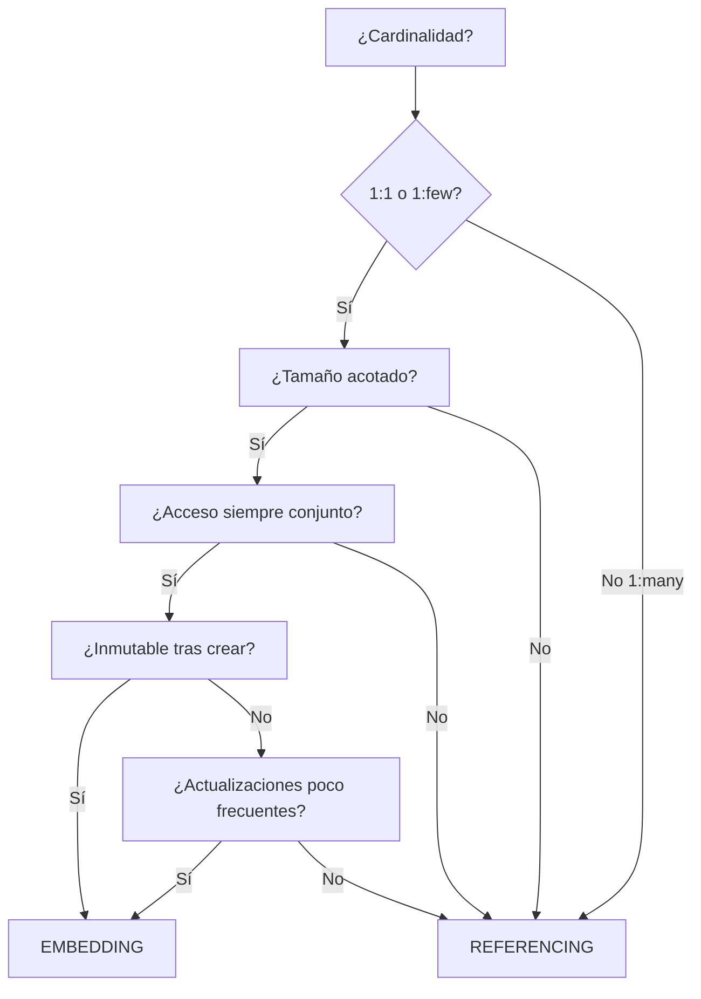

# 5. Justificación de Embedding vs Referencing

## 5.1 Framework de Decisión



---

## 5.2 Decisiones por Entidad

### EMBEDDING

| Entidad | Patrón | Justificación |
|---------|--------|---------------|
| `orders.items[]` | **Extended Reference** | Snapshot congelado al crear pedido. Inmutable. Contiene `menuItemId`, `name`, `unitPrice`, `quantity`, `subtotal`. Evita $lookup en hot path de lectura de pedidos |
| `orders.statusHistory[]` | **Bucket Pattern** | Crecimiento acotado (máx. 7 transiciones). Siempre leído junto a la orden. Cada entrada: `{ status, timestamp, actor, durationFromPrevSec }` |
| `orders.deliveryAddress` | **Embedding 1:1** | Copia congelada de la dirección al momento del pedido. El usuario puede cambiar su dirección después sin afectar pedidos anteriores |
| `restaurants.address` | **Embedding 1:1** | Dirección física del restaurante. Una por restaurante. Siempre leída junto al perfil |
| `restaurants.operatingHours` | **Embedding 1:1** | Horarios por día. Siempre necesarios para validación de disponibilidad. Tamaño fijo (7 días) |
| `users.defaultAddress` | **Embedding 1:1** | Dirección principal. Se copia al pedido al crear. Acceso siempre junto al perfil |
| `users.favoriteRestaurants` | **Subset Pattern** | Array de ObjectIds limitado con `$slice`. Solo los últimos N (e.g., 20). Evita crecimiento ilimitado |
| `users.orderHistory` | **Subset Pattern** | Últimos N pedidos como ObjectIds. Quick access para "pedidos recientes" |
| `carts.items[]` | **Extended Reference** | Snapshot denormalizado para lectura rápida del carrito. Efímero (TTL 24h). Incluye `available` flag para cascada de disponibilidad |
| `reviews.restaurantResponse` | **Embedding 1:1** | Una respuesta por reseña. Siempre mostrada junto a la reseña. Inmutable una vez creada |

### REFERENCING

| Entidad | Justificación |
|---------|---------------|
| `menu_items.restaurantId` → `restaurants._id` | 1:many (cientos de platillos por restaurante). Ciclo de vida independiente. Requiere indexación propia. Colección de 50K+ docs |
| `orders.userId` → `users._id` | 1:many (un usuario, muchos pedidos). Actualización independiente del perfil |
| `orders.restaurantId` → `restaurants._id` | 1:many. $lookup solo cuando se necesitan datos del restaurante en listados |
| `reviews.userId/restaurantId/orderId` | 1:many en cada dimensión. Agregaciones por cada dimensión (promedio por restaurante, reseñas por usuario) |
| `delivery_zones.restaurantId` → `restaurants._id` | 1:few pero con datos geoespaciales complejos (polígonos). Queries $geoIntersects independientes |
| `carts.userId/restaurantId` | Referencias a colecciones independientes. Carrito es efímero |

---

## 5.3 Patrones Avanzados Aplicados

### Extended Reference Pattern
**Dónde:** `orders.items[]`, `carts.items[]`

Almacena un subconjunto de campos del documento referenciado directamente en el documento padre. Evita $lookup en el hot path.

```
menu_items document:                    orders.items[] snapshot:
{                                       {
  _id: ObjectId("mi_001"),                menuItemId: ObjectId("mi_001"),
  restaurantId: ObjectId("r1"),           name: "Pizza Margherita",  ← copiado
  name: "Pizza Margherita",               unitPrice: 89.00,          ← copiado
  price: 89.00,                           quantity: 2,               ← del carrito
  category: "Pizzas",                     subtotal: 178.00           ← calculado
  allergens: [...],                     }
  available: true,
  salesCount: 342
}
```

### Computed Pattern
**Dónde:** `restaurant_stats`, `restaurants.menuItemCount`, `menu_items.salesCount`

Pre-computa valores que de otro modo requerirían agregaciones costosas en tiempo de consulta.

### Bucket Pattern
**Dónde:** `orders.statusHistory[]`

Agrupa datos relacionados en un array embebido dentro del documento padre. Crecimiento acotado y predecible.

### Subset Pattern
**Dónde:** `users.favoriteRestaurants`, `users.orderHistory`

Almacena solo un subconjunto (últimos N) de una relación potencialmente ilimitada. Usa `$slice` para mantener el tamaño.

```javascript
// Agregar a favoritos con Subset Pattern (máx 20)
db.users.updateOne(
  { _id: userId },
  { $push: { favoriteRestaurants: { $each: [restaurantId], $slice: -20 } } }
);
```
