# 6. Flujos Críticos de Datos (12 Critical Paths)

Cada flujo describe cómo la información **viaja, se transforma y se recibe** a través de las capas del sistema.

---

## Flow 1: Restaurant Discovery (Búsqueda Geoespacial)

**Trigger:** Usuario busca restaurantes cercanos.

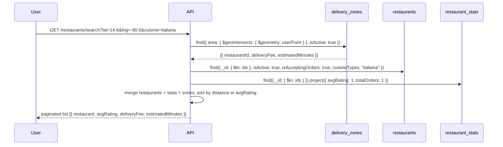

**Transformación:** User Point → $geoIntersects Polygon zones → restaurantIds → filter active + cuisine → enrich with pre-computed stats + deliveryFee → sort + paginate.

**Colecciones:** `delivery_zones` (read) → `restaurants` (read) → `restaurant_stats` (read)

---

## Flow 2: Menu Browsing

**Trigger:** Usuario selecciona un restaurante.

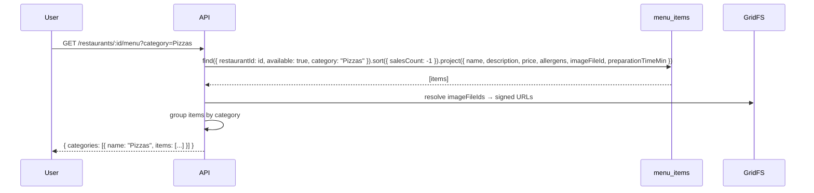

**Transformación:** Flat documents → filter available + category → project minimal fields → resolve image URLs → group by category.

**Colecciones:** `menu_items` (read) + `GridFS` (read)

---

## Flow 3: Cart Management (Add / Modify / Remove)

**Trigger:** Usuario interactúa con su carrito.

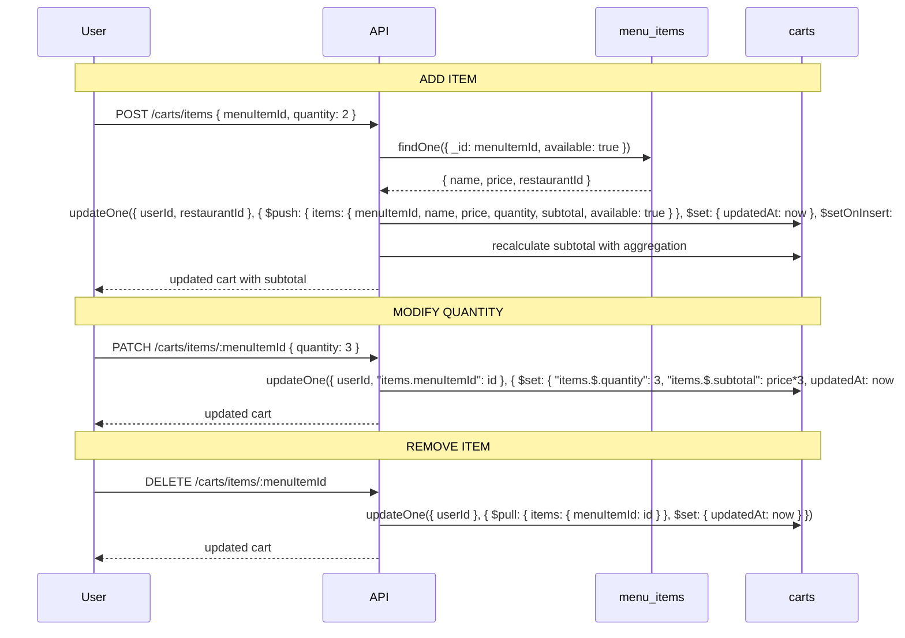

**Transformación:** Menu item ref → Extended Reference snapshot into `carts.items[]` (denormalized name + price) → subtotal recalculated on every mutation.

**Operaciones MongoDB:** `$push`, `$set` con positional `$`, `$pull`, `upsert: true`, `$setOnInsert`.

**Colecciones:** `menu_items` (read) → `carts` (write). Auto-expire via TTL index on `expiresAt`.

---

## Flow 4: Order Placement (Transacción Atómica Crítica)

**Trigger:** Usuario confirma checkout.

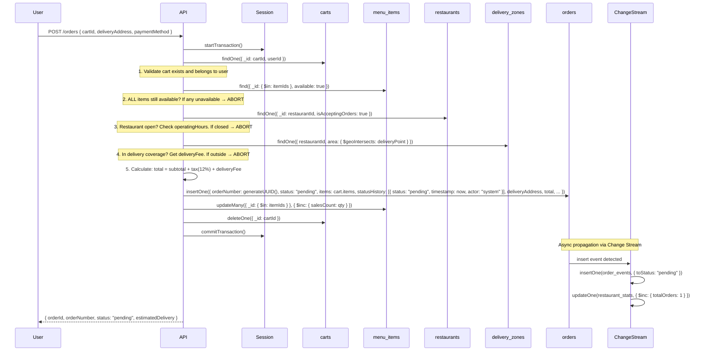

**Atomicidad:** 4 colecciones en 1 transacción: `carts` (read+delete), `menu_items` (update), `restaurants` (read), `delivery_zones` (read), `orders` (insert). Rollback completo si cualquier validación falla.

**Transformación:** Cart snapshot → congelado en `orders.items[]` (inmutable) → salesCount incrementado → carrito destruido → evento emitido async.

---

## Flow 5: Order Confirmation / Rejection (Restaurante)

**Trigger:** Restaurante acepta o rechaza pedido.

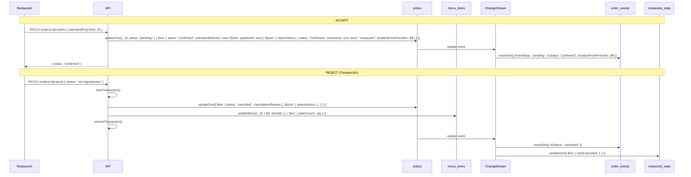

**Transformación:** Status mutation + `statusHistory[]` push (Bucket Pattern) → Change Stream → immutable event to Time Series → stats updated.

---

## Flow 6: Order Status Progression (State Machine)

**Trigger:** Actor (restaurante, repartidor, sistema) avanza el estado del pedido.

```mermaid
sequenceDiagram
  participant Actor
  participant API
  participant orders as orders
  participant CS as ChangeStream
  participant oe as order_events
  participant stats as restaurant_stats

  Actor->>API: PATCH /orders/:id/status { status: "preparing" }
  API->>API: Validate FSM: confirmed → preparing is LEGAL
  API->>orders: findOne({ _id }) get current status + last statusHistory timestamp
  API->>orders: updateOne({ _id, status: "confirmed" }, { $set: { status: "preparing", updatedAt: now }, $push: { statusHistory: { status: "preparing", timestamp: now, durationFromPrevSec: diff, actor: "restaurant" } } })
  orders->>CS: update event
  CS->>oe: insertOne({ fromStatus: "confirmed", toStatus: "preparing", durationFromPrevSec: diff })

  Note over CS, stats: On "delivered" only
  CS->>stats: updateOne({ $inc: { totalDelivered: 1, totalRevenue: order.total }, $set: { avgOrderValue: recalc, lastOrderAt: now } })
```

**Reglas FSM (validadas en API):**

```
VALID_TRANSITIONS = {
  pending:          → [confirmed, cancelled]
  confirmed:        → [preparing, cancelled]
  preparing:        → [ready_for_pickup, cancelled]
  ready_for_pickup: → [picked_up]
  picked_up:        → [delivered]
  delivered:        → []  (terminal)
  cancelled:        → []  (terminal)
}
```

---

## Flow 7: Bulk Menu Item Upload

**Trigger:** Restaurante carga platillos masivamente.

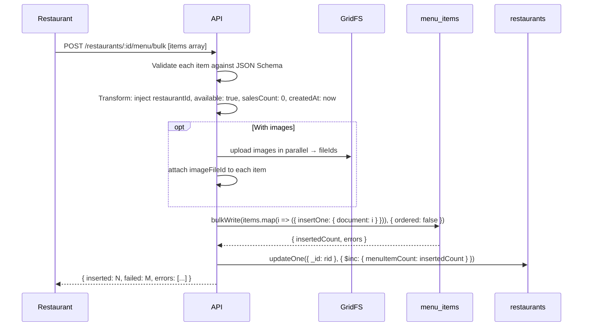

**Transformación:** Raw array → schema validation → enriched with defaults → optional GridFS upload → `bulkWrite` ordered:false (parallelism) → restaurant metadata updated. Partial failures collected, not fatal.

---

## Flow 8: Dish Availability Toggle (Cascada a Carts)

**Trigger:** Restaurante marca platillo como no disponible.

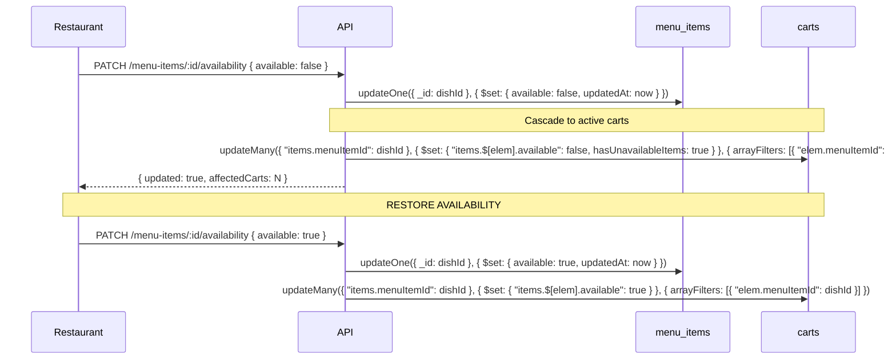

**Transformación:** Single field toggle on `menu_items` → cascade via `arrayFilters` to all active `carts` containing that item → `hasUnavailableItems` flag updated for checkout validation in Flow 4.

---

## Flow 9: Restaurant Availability Toggle

**Trigger:** Restaurante se abre/cierra manualmente o automáticamente.

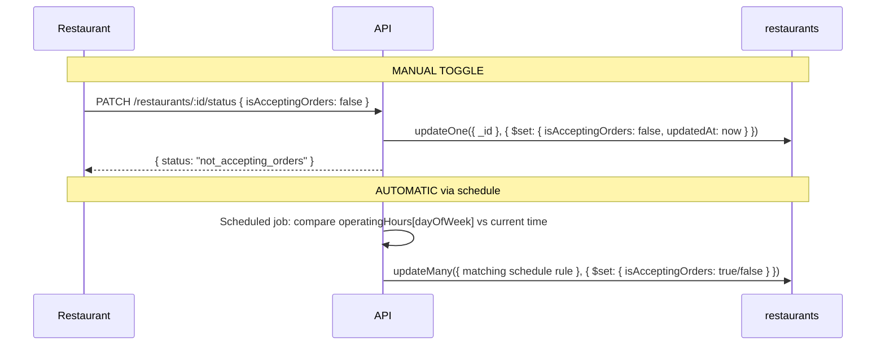

**Sin cascada.** In-progress orders CONTINÚAN. Active carts PERMANECEN pero checkout bloqueado en validación (Flow 4, paso 3).

---

## Flow 10: Review Submission + Rating Propagation

**Trigger:** Usuario deja reseña tras pedido entregado.

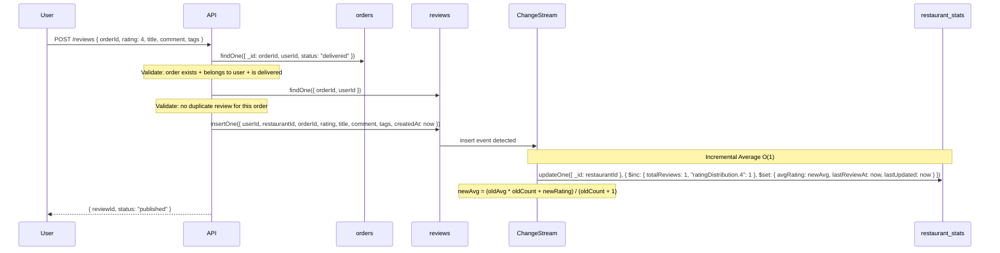

**Transformación:** Review validated → stored with references → Change Stream triggers O(1) incremental average recalculation (no full recompute).

---

## Flow 11: Daily Revenue Batch Aggregation

**Trigger:** Scheduled job nightly at 02:00 UTC.

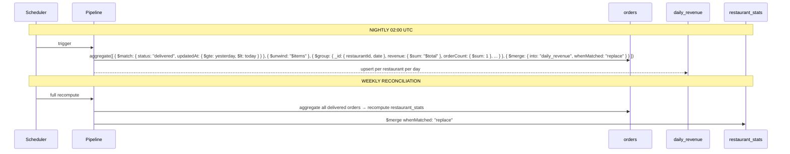

**Transformación:** Raw orders (OLTP) → $match delivered → $unwind items → $group by restaurant+date → compute aggregates → $merge into `daily_revenue` (OLAP). Weekly: full reconciliation overwriting `restaurant_stats`.

---

## Flow 12: Real-Time Dashboard Queries (Paralelo)

**Trigger:** Admin o restaurante accede al dashboard.

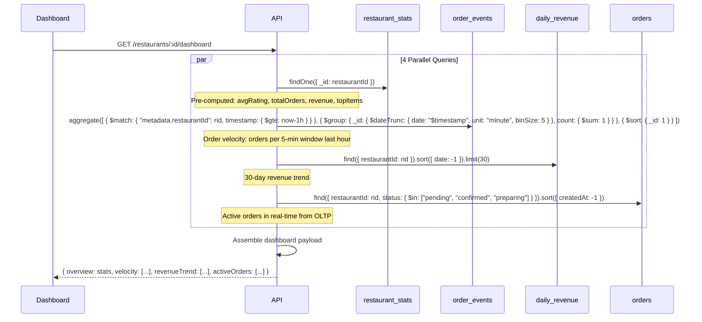

**Transformación:** 4 queries paralelas (3 OLAP + 1 OLTP) → no cross-collection $lookups → assembled into dashboard response. Read preference `secondaryPreferred` for OLAP queries.
