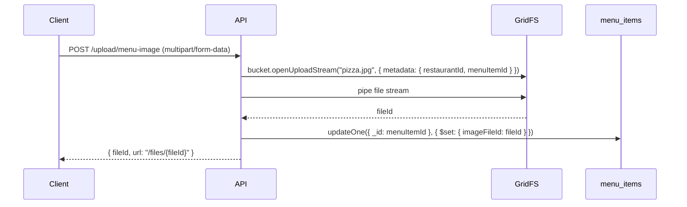

# 12. GridFS y Manejo de Archivos

## 12.1 Estrategia de Almacenamiento

| Tipo de Archivo | Bucket GridFS | Referencia desde |
|-----------------|---------------|------------------|
| Imágenes de platillos | `images` | `menu_items.imageFileId` |
| Logos de restaurantes | `images` | `restaurants.logoFileId` |

**Bucket name:** `images` → colecciones `images.files` + `images.chunks`

---

## 12.2 Flujo de Upload



**Código:**

```javascript
const bucket = new GridFSBucket(db, { bucketName: "images" });

const uploadStream = bucket.openUploadStream(filename, {
  metadata: { restaurantId, menuItemId, contentType: "image/jpeg", uploadedBy: userId }
});

fs.createReadStream(filePath).pipe(uploadStream);

uploadStream.on("finish", async () => {
  await db.menu_items.updateOne(
    { _id: menuItemId },
    { $set: { imageFileId: uploadStream.id, updatedAt: new Date() } }
  );
});
```

## 12.3 Flujo de Download

```javascript
app.get("/files/:fileId", async (req, res) => {
  const fileId = new ObjectId(req.params.fileId);
  const files = await db.collection("images.files").findOne({ _id: fileId });
  if (!files) return res.status(404).send("Not found");

  res.set("Content-Type", files.metadata.contentType);
  bucket.openDownloadStream(fileId).pipe(res);
});
```

## 12.4 Flujo de Delete

```javascript
await bucket.delete(fileId);
await db.menu_items.updateOne(
  { imageFileId: fileId },
  { $unset: { imageFileId: "" }, $set: { updatedAt: new Date() } }
);
```

---

## 12.5 Colección con ≥50,000 Documentos: `menu_items`

**Estrategia de seed:** 500 restaurantes × 100 platillos = 50,000 documentos.

**Script de seed (ver `scripts/seed-data.js`):**

```javascript
const categories = ["Entradas", "Platos Principales", "Postres", "Bebidas", "Ensaladas", "Sopas"];
const names = ["Pizza Margherita", "Pasta Carbonara", "Hamburguesa", "Ensalada César", "Sopa", "Tacos", "Burrito", ...];

const bulkOps = [];
for (const restaurantId of restaurantIds) {
  for (let i = 0; i < 100; i++) {
    bulkOps.push({
      insertOne: {
        document: {
          restaurantId,
          name: `${names[i % names.length]} #${i}`,
          description: "Descripción del platillo",
          price: Math.round((Math.random() * 150 + 25) * 100) / 100,
          category: categories[Math.floor(Math.random() * categories.length)],
          allergens: [], tags: [],
          available: true,
          preparationTimeMin: Math.floor(Math.random() * 30) + 10,
          imageFileId: null,
          salesCount: 0,
          createdAt: new Date(), updatedAt: new Date()
        }
      }
    });
  }
}

const result = await db.menu_items.bulkWrite(bulkOps, { ordered: false });
console.log(`Inserted: ${result.insertedCount}`);
```

## 12.6 Bulk Upload de Imágenes

```javascript
async function bulkUploadImages(items, imageDir) {
  const bucket = new GridFSBucket(db, { bucketName: "images" });
  for (const item of items) {
    const imagePath = path.join(imageDir, `${item.category.toLowerCase()}.jpg`);
    if (!fs.existsSync(imagePath)) continue;

    const uploadStream = bucket.openUploadStream(`${item.name}.jpg`, {
      metadata: { restaurantId: item.restaurantId, menuItemId: item._id }
    });
    fs.createReadStream(imagePath).pipe(uploadStream);

    await new Promise((resolve) => uploadStream.on("finish", resolve));
    await db.menu_items.updateOne(
      { _id: item._id },
      { $set: { imageFileId: uploadStream.id } }
    );
  }
}
```
